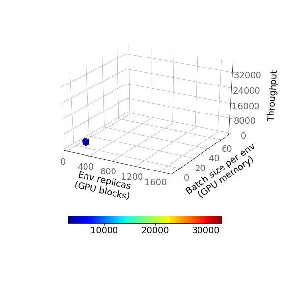
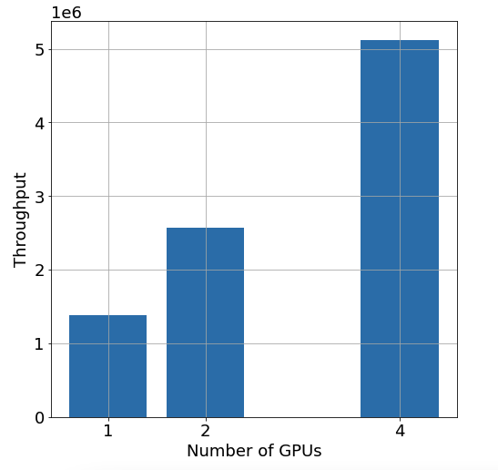

Copyright (c) 2021, salesforce.com, inc. \
All rights reserved. \
SPDX-License-Identifier: BSD-3-Clause. \
For full license text, see the LICENSE file in the repo root or https://opensource.org/licenses/BSD-3-Clause.

# Introduction
In this tutorial, we will describe how to scale up the training throughput (or environment steps per second) with WarpDrive. Specifically, the latest release (v1.4) of WarpDrive allows for
- maximally utilizing the GPU threads and memory
- scaling to multiple GPUs
With this capability, we essentially can gather maximally large batch sizes in the same time as before, thus yielding massive throughput gains.

We acknowledge that a higher throughput allows for faster training, but may not necessarily guarantee it depending on the choice of hyperparameters.

## Maximizing GPU Utilization
WarpDrive can automatically maximize both the number of usable GPU blocks and the GPU global memory. As such, this means that the GPU is maximally utilized, and leads to a massive throughput improvement. Under the hood, we use two binary searches to determine the best block size (or the number of environment replicas) and best training batch size to use to scale up training. Recall that by design, WarpDrive runs each replica of the environment on a separate block. We use the first binary search to determine the maximum number of GPU blocks (or equivalently, threads) that can be simultaneously run. Next, we determine the largest trajectory batch size that can be accumulated on the GPU's global memory, again via a binary search.

The animation below is a sample run for the continuous version of the Tag environment, and depicts how we perform the binary searches in order to maximize GPU use. The first binary search is performed with a single batch size per env, and determines the maximum number of env replicas (or the GPU blocks) that can be launched on the GPU. The second binary search is performed along the batch size per env variable, and determines the maximum training batch size that completely fills up the GPU memory. Compared to our throughput numbers from our earlier release, this feature provided over a 3x improvement!



## Distributed Training on Multiple GPUs (Horizontal Scaling)

WarpDrive supports horizontal scaling or distributed training on multiple GPU devices. Conceptually, assuming there are N GPUs (N > 1), the distributed training workflow in WarpDrive comprises the following.
- WarpDrive initializes N child processes at the CPU host. Each host child process manages one WarpDrive worker instance which includes all the WarpDrive components including the policy models. Every WarpDrive worker instance exclusively runs at one GPU device controlled by the WarpDrive _DeviceContext_ manager.
- Each worker runs the environment simulation and the gradient backpropagation for its own local policy model asynchronously. At the end of every training iteration, the gradients are reduced and synchronized.
All the models are kept in sync via Pytorch’s [DistributedDataParallel](https://pytorch.org/docs/stable/notes/ddp.html) distributed training APIs.
- The figure below plots the throughput for the gridworld version of the Tag environment versus the number of GPUs. We see that the throughput scales (almost) linearly versus the number of GPUs used for training. While there is no data transfer between the CPU host and the GPU devices, there is some minimal and iteration-wise communication among GPUs that is necessary to perform the gradient synchronizations.



## Invoking Distributed Training
An example end-to-end RL training script that can be used to set up your own custom training pipeline is [here](https://github.com/salesforce/warp-drive/blob/master/warp_drive/training/example_training_script_pycuda.py). Invoke single-GPU training by using
```shell
python warp_drive/training/example_training_script_pycuda.py --env <ENV-NAME>
```
where `<ENV-NAME>` can be `tag_gridworld` or `tag_continuous` (or any new env that you build).

In order to perform distributed training, the user only needs to provide the `num_gpus` (or `n`) argument to the trainer. Effectively, the training script may be invoked as
```shell
python warp_drive/training/example_training_script_pycuda.py --env <ENV-NAME> --num_gpus <NUM_GPUS>
```

The end user can also use the auto-scaling feature to maximize the GPU utilization by simply using the `auto-scale` (`a`) argument. Accordingly, 
```shell
python warp_drive/training/example_training_script_pycuda.py --env <ENV-NAME> --auto_scale
```
With auto-scaling, WarpDrive will automatically determine the best block size and training batch size to use. It will also determine the number of available GPUs and perform training on all the GPUs.


## Customize Distributed Training
If you have your own WarpDrive training script and try to run WarpDrive with multiple GPUs, just remember both the env wrapper and the trainer class constructors consume the `process_id` argument, so that the WarpDrive DeviceContext manager understands which device the corresponding processes run on. Additionally, the env_wrapper also needs to have an `event_messenger` argument passed in to sync up the compilation statuses among processes. WarpDrive internally takes care of associating the correct device id to its corresponding process; however these *dummy* arguments still need to be set when invoking the env wrapper and the trainer as shown below. For reference, please refer to the [example training script](https://github.com/salesforce/warp-drive/blob/master/warp_drive/training/example_training_script.py).

```python
env_wrapper = EnvWrapper(
    env_obj=TagContinuous(**run_config["env"]),
    num_envs=run_config["trainer"]["num_envs"],
    env_backend="pycuda",
    event_messenger=event_messenger,
    process_id=device_id,
)

trainer = Trainer(env_wrapper, 
                  run_config, 
                  policy_tag_to_agent_id_map, 
                  device_id=device_id,
                  num_devices=num_devices,)
```

You've now seen the entire end-to-end multi-agent and multi-GPU RL pipeline! Happy training!

We also have a [trainer](https://github.com/salesforce/warp-drive/blob/master/warp_drive/training/lightning_trainer.py) compatible with [Pytorch Lightning](https://www.pytorchlightning.ai/) and have prepared a tutorial on training with WarpDrive and Pytorch Lightning [here](https://github.com/salesforce/warp-drive/blob/master/tutorials/tutorial-7-training_with_warp_drive_and_pytorch_lightning.ipynb).

For your reference, all our tutorials are here:
1. [WarpDrive basics(intro and pycuda)](https://www.github.com/salesforce/warp-drive/blob/master/tutorials/tutorial-1.a-warp_drive_basics.ipynb)
2. [WarpDrive basics(numba)](https://www.github.com/salesforce/warp-drive/blob/master/tutorials/tutorial-1.b-warp_drive_basics.ipynb)
3. [WarpDrive sampler(pycuda)](https://www.github.com/salesforce/warp-drive/blob/master/tutorials/tutorial-2.a-warp_drive_sampler.ipynb)
4. [WarpDrive sampler(numba)](https://www.github.com/salesforce/warp-drive/blob/master/tutorials/tutorial-2.b-warp_drive_sampler.ipynb)
5. [WarpDrive resetter and logger](https://www.github.com/salesforce/warp-drive/blob/master/tutorials/tutorial-3-warp_drive_reset_and_log.ipynb)
6. [Create custom environments (pycuda)](https://www.github.com/salesforce/warp-drive/blob/master/tutorials/tutorial-4.a-create_custom_environments_pycuda.md)
7. [Create custom environments (numba)](https://www.github.com/salesforce/warp-drive/blob/master/tutorials/tutorial-4.b-create_custom_environments_numba.md)
8. [Training with WarpDrive](https://www.github.com/salesforce/warp-drive/blob/master/tutorials/tutorial-5-training_with_warp_drive.ipynb)
9. [Scaling Up training with WarpDrive](https://www.github.com/salesforce/warp-drive/blob/master/tutorials/tutorial-6-scaling_up_training_with_warp_drive.md)
10. [Training with WarpDrive + Pytorch Lightning](https://github.com/salesforce/warp-drive/blob/master/tutorials/tutorial-7-training_with_warp_drive_and_pytorch_lightning.ipynb)

```python

```
